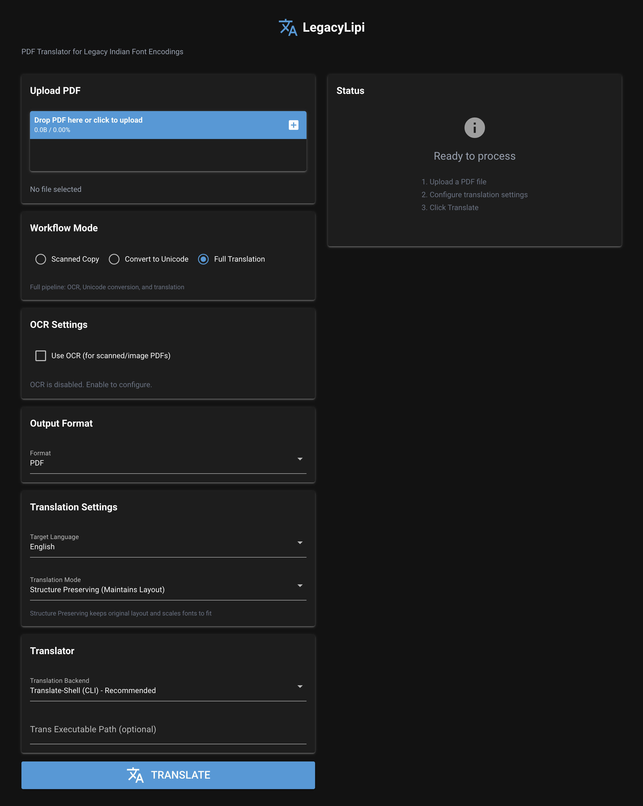

# LegacyLipi

**Legacy Font PDF Translator** - Translate PDF documents with legacy Indian font encodings to English.

## Installation

### From PyPI (Recommended)

```bash
pip install legacylipi
```

Or with uv:

```bash
uv tool install legacylipi
```

### From Source

```bash
git clone https://github.com/biswasbiplob/legacylipi.git
cd legacylipi
uv sync
```

### Usage

```bash
# CLI translation
legacylipi translate input.pdf -o output.txt

# Launch web UI
legacylipi ui

# Launch UI on custom port
legacylipi ui --port 3000
```

## Problem

Millions of government documents, legal papers, and archival materials in Indian regional languages (Marathi, Hindi, Tamil, etc.) were created using legacy font encoding systems (Shree-Lipi, Kruti Dev, APS, Chanakya, etc.). These fonts map Devanagari/regional script glyphs to ASCII/Latin code points, making them unreadable by standard translation tools.

**Example:**
- What the PDF displays: महाराष्ट्र राजभाषा अधिनियम
- What text extraction produces: `´ÖÆüÖ¸üÖ™Òü ¸üÖ•Ö³ÖÖÂÖÖ †×¬Ö×®ÖμÖ´Ö`
- What Google Translate sees: Gibberish

## Solution

LegacyLipi:
1. **Detects** the font encoding scheme used in a PDF (legacy or Unicode)
2. **Converts** legacy-encoded text to proper Unicode
3. **Alternatively**, uses **OCR** to extract text from scanned PDFs
4. **Translates** the Unicode text to the target language
5. **Outputs** translated text in various formats (text, markdown, PDF)

## Installation

```bash
# Clone and install
git clone https://github.com/biswasbiplob/legacylipi.git
cd legacylipi
uv sync

# With all optional backends
uv sync --all-extras
```

### OCR Support (Optional)

LegacyLipi supports multiple OCR backends:

| Backend | Description | GPU Support |
|---------|-------------|-------------|
| Tesseract | Local, free, most language packs | CPU only |
| Google Vision | Cloud, paid, best accuracy | N/A |
| EasyOCR | Local, free, good for Indian languages | CUDA, MPS (Apple Silicon) |

**Tesseract (default):**
```bash
# Ubuntu/Debian
sudo apt-get install tesseract-ocr tesseract-ocr-mar tesseract-ocr-hin

# macOS
brew install tesseract tesseract-lang
```

**EasyOCR with GPU (optional):**
```bash
# Install with EasyOCR support
uv sync --extra easyocr

# For GPU acceleration, install PyTorch with CUDA or MPS support
```

**Google Vision (optional):**
```bash
uv sync --extra vision
# Requires GCP credentials (GOOGLE_APPLICATION_CREDENTIALS)
```

See [docs/cli-reference.md](docs/cli-reference.md) for detailed OCR options and language codes.

## Quick Start

```bash
# Basic translation
uv run legacylipi translate input.pdf -o output.txt

# Output as PDF (preserves layout)
uv run legacylipi translate input.pdf -o output.pdf --format pdf

# OCR for scanned documents
uv run legacylipi translate input.pdf --use-ocr -o output.txt

# Use local LLM (requires Ollama)
uv run legacylipi translate input.pdf --translator ollama --model llama3.2

# Detect encoding only
uv run legacylipi detect input.pdf
```

See [docs/cli-reference.md](docs/cli-reference.md) for complete CLI documentation.

## Web UI

LegacyLipi includes a web interface for easy PDF translation without command-line usage.

```bash
uv run legacylipi-ui
```

Open **http://localhost:8080** in your browser.



**Features:**
- Drag-and-drop PDF upload
- Multiple translation backends
- OCR support with language selection
- Structure-preserving or flowing text modes
- Real-time progress tracking
- Direct download of translated files

## Translation Backends

| Backend | Description | Setup |
|---------|-------------|-------|
| `trans` | translate-shell CLI (recommended) | `brew install translate-shell` |
| `google` | Google Translate (free API) | Works out of the box |
| `mymemory` | MyMemory API (free) | Works out of the box |
| `ollama` | Local LLM via Ollama | [Ollama](https://ollama.ai) required |
| `openai` | OpenAI GPT models | Set `OPENAI_API_KEY` |
| `gcp_cloud` | Google Cloud Translation | GCP project + credentials |

See [docs/translation-backends.md](docs/translation-backends.md) for detailed setup guides.

## Supported Encodings

| Encoding | Font Family | Language | Status |
|----------|-------------|----------|--------|
| shree-lipi | Shree-Lipi, Shree-Dev-0714 | Marathi | ✅ Built-in |
| kruti-dev | Kruti Dev | Hindi | ✅ Built-in |
| aps-dv | APS-DV | Hindi | 🔄 Detection only |
| chanakya | Chanakya | Hindi | 🔄 Detection only |
| dvb-tt | DVB-TT, DV-TTYogesh | Hindi | 🔄 Detection only |
| walkman-chanakya | Walkman Chanakya | Hindi | 🔄 Detection only |
| shusha | Shusha | Hindi | 🔄 Detection only |

## CLI Commands

| Command | Description |
|---------|-------------|
| `translate` | Full pipeline: parse → detect → convert → translate → output |
| `convert` | Convert legacy encoding to Unicode (no translation) |
| `extract` | Extract text from PDF (OCR or font-based) |
| `detect` | Analyze PDF and report detected encoding |
| `encodings` | List supported font encodings |
| `usage` | Show API usage statistics |

See [docs/cli-reference.md](docs/cli-reference.md) for full command reference.

## Development

See [docs/development.md](docs/development.md) for setup instructions, running tests, project structure, and adding new encodings.

### Architecture

```
┌─────────────────────────────────────────────────────────────────────────┐
│                              LegacyLipi                                 │
├─────────────────────────────────────────────────────────────────────────┤
│                                                                         │
│  ┌──────────────────────────────────────────────────────────────────┐   │
│  │                      Text Extraction                             │   │
│  │  ┌──────────────┐              ┌──────────────┐                  │   │
│  │  │   PDF        │    OR        │   OCR        │                  │   │
│  │  │   Parser     │              │   Parser     │                  │   │
│  │  │ (font-based) │              │ (Tesseract)  │                  │   │
│  │  └──────────────┘              └──────────────┘                  │   │
│  └──────────────────────────────────────────────────────────────────┘   │
│         │                                │                              │
│         ▼                                ▼                              │
│  ┌──────────────┐    ┌──────────────┐                                   │
│  │   Encoding   │───▶│   Unicode    │◀──── (OCR output is               │
│  │   Detector   │    │   Converter  │       already Unicode)            │
│  └──────────────┘    └──────────────┘                                   │
│                             │                                           │
│                             ▼                                           │
│         ┌───────────────────────────────────────────────────────────┐   │
│         │                 Translation Engine                        │   │
│         │  ┌────────┬────────┬──────────┬────────┬────────┬─────┐   │   │
│         │  │ trans  │ Google │ MyMemory │ Ollama │ OpenAI │ GCP │   │   │
│         │  │ (CLI)  │ Trans. │  (API)   │(Local) │ (API)  │Cloud│   │   │
│         │  └────────┴────────┴──────────┴────────┴────────┴─────┘   │   │
│         └───────────────────────────────────────────────────────────┘   │
│                             │                                           │
│                             ▼                                           │
│         ┌───────────────────────────────────────────────┐               │
│         │            Output Generator                   │               │
│         │  ┌──────┬────────┬───────┐                    │               │
│         │  │ .txt │  .md   │ .pdf  │                    │               │
│         │  └──────┴────────┴───────┘                    │               │
│         └───────────────────────────────────────────────┘               │
│                                                                         │
└─────────────────────────────────────────────────────────────────────────┘
```

**Pipeline Flow:**
1. **Parse PDF** → Extract text with PDF parser or OCR
2. **Detect Encoding** → Identify legacy encoding scheme
3. **Convert to Unicode** → Transform legacy text to Unicode
4. **Translate** → Use translation backend
5. **Generate Output** → Create PDF/text/markdown

## License

MIT

## Contributing

Contributions are welcome! Please:

1. Fork the repository
2. Create a feature branch (`git checkout -b feature/amazing-feature`)
3. Make your changes
4. Run tests (`uv run pytest`)
5. Commit and push
6. Open a Pull Request
